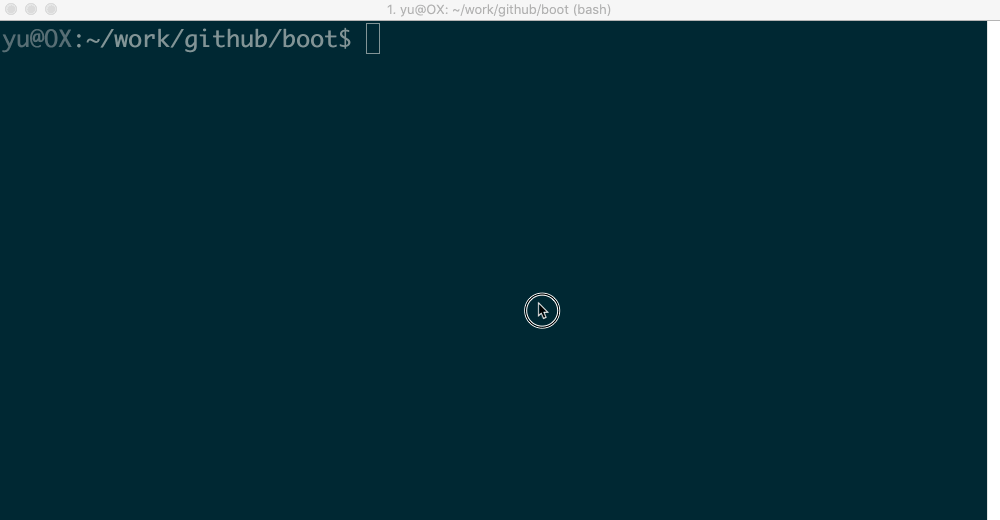

# Android_boot_image_editor
[](https://github.com/cfig/Android_boot_image_editor/actions/workflows/main.yml)
[](http://www.apache.org/licenses/LICENSE-2.0.html)

A tool for reverse engineering Android ROM images.

## Getting Started

#### install required packages

Linux: `sudo apt install git device-tree-compiler lz4 xz-utils zlib1g-dev openjdk-17-jdk gcc g++ python3 python-is-python3 p7zip-full`

Mac: `brew install lz4 xz dtc`

Mac: Make sure you have `JDK9+` properly installed. JDK 17 is recommended.

Windows Subsystem for Linux(WSL): `sudo apt install git device-tree-compiler lz4 xz-utils zlib1g-dev openjdk-17-jdk gcc g++ python`

Windows: Make sure you have `python3`, `JDK9+` and `openssl` properly installed.
An easy way is to install [Anaconda](https://www.anaconda.com/products/individual#windows) and [Oracle JDK 17](https://www.oracle.com/java/technologies/downloads/#java17), then run the program under anaconda PowerShell.
Or install them with chocolate: `choco install openssl dtc-msys2`

#### Parsing and packing

Put your boot.img to current directory, then start gradle 'unpack' task:

```bash
cp <original_boot_image> boot.img
./gradlew unpack
```

Your get the flattened kernel and /root filesystem under **./build/unzip\_boot**:

    build/unzip_boot/
    ├── boot.json     (boot image info)
    ├── boot.avb.json (AVB only)
    ├── kernel
    ├── second        (2nd bootloader, if exists)
    ├── dtb           (dtb, if exists)
    ├── dtbo          (dtbo, if exists)
    └── root          (extracted initramfs)

Then you can edit the actual file contents, like rootfs or kernel.
Now, pack the boot.img again

    ./gradlew pack

You get the repacked boot.img at $(CURDIR):

    boot.img.signed

Well done you did it! The last step is to star this repo :smile


### live demo
<!--  -->
<p align="center">
    
</p>

## Supported ROM image types

| Image Type      | file names                              |  platforms    | note |
| --------------- | -----------------------------------     | ----------    | ---- |
| boot images     | boot.img, vendor_boot.img, init_boot.img|  all          | |
| recovery images | recovery.img, recovery-two-step.img     |  all          | |
| vbmeta images   | vbmeta.img, vbmeta_system.img etc.      |  all          | |
| dtbo images     | dtbo.img                                | linux & mac   | |
| sparse images   | system.img, vendor.img, product.img etc.| linux & mac   | need **hacking mode**\* |
| OTA payload     | payload.bin                             | linux & mac   | |

Please note that the boot.img MUST follows AOSP verified boot flow, either [Boot image signature](https://source.android.com/security/verifiedboot/verified-boot#signature_format) in VBoot 1.0 or [AVB HASH footer](https://android.googlesource.com/platform/external/avb/+/master/README.md#The-VBMeta-struct) (a.k.a. AVB) in VBoot 2.0.

**hacking mode**\*:

Open build.gradle.kts, Line #8, change
```
val bHackingMode = false
```
to
```
val bHackingMode = true
```
This will enable c++ modules, which is necessary for working with sparse images.

## compatible devices

| Device Model                   | Manufacturer | Compatible           | Android Version          | Note |
|--------------------------------|--------------|----------------------|--------------------------|------|
| ADT-3 (adt3)                   | Askey/Google | Y                    | 12 (spp2.210219.010)     | amlogic inside, <Br>Android TV |
| Pixel 3 (blueline)             | Google       | Y                    | 12 (spp2.210219.008, <Br>2021)| |
| Pixel 3 (blueline)             | Google       | Y                    | 11 (RP1A.200720.009, <Br>2020)| [more ...](doc/additional_tricks.md#pixel-3-blueline) |
| Pixel 3 (blueline)             | Google       | Y                    | Q preview (qpp2.190228.023, <Br>2019)| [more ...](doc/additional_tricks.md#pixel-3-blueline) |
| Redmi K30 4G (phoenix[n])      | XiaoMi       | Y                    | 10 | [verified](https://github.com/cfig/Android_boot_image_editor/issues/17#issuecomment-817169307) by @eebssk1 |
| TS10                           | Topway       | Y                    | 10                       | car headunit, @mariodantas |
| Pixel XL (marlin)              | HTC          | Y                    | 9.0.0 (PPR2.180905.006, <Br>Sep 2018)| [more ...](doc/additional_tricks.md#pixel-xl-marlin) |
| K3 (CPH1955)                   | OPPO         | Y for recovery.img<Br> N for boot.img  | Pie    | [more](doc/additional_tricks.md#k3-cph1955) |
| Z18 (NX606J)                   | ZTE          | Y                    | 8.1.0                    | [more...](doc/additional_tricks.md#nx606j) |
| Nexus 9 (volantis/flounder)    | HTC          | Y(with some tricks)  | 7.1.1 (N9F27M, Oct 2017) | [tricks](doc/additional_tricks.md#tricks-for-nexus-9volantis)|
| Nexus 5x (bullhead)            | LG           | Y                    | 6.0.0_r12 (MDA89E)       |      |
| Moto X (2013) T-Mobile         | Motorola     | N                    |                          |      |
| X7 (PD1602_A_3.12.8)           | VIVO         | N                    | ?                        | [Issue 35](https://github.com/cfig/Android_boot_image_editor/issues/35) |
| Realme GT Neo 3                | Realme       | N                    | 12                       | [Issue 105](https://github.com/cfig/Android_boot_image_editor/issues/105) |

## more examples
<details>
  <summary>working with recovery.img</summary>

Please remember to clean the work directory first.

```bash
rm *.img
cp <your_recovery_image> recovery.img
./gradlew unpack
./gradlew pack
```

</details>

<details>
  <summary>working with vbmeta.img</summary>


```bash
rm *.img
cp <your_vbmeta_image> vbmeta.img
./gradlew unpack
./gradlew pack
```

</details>

<details>
  <summary>clean workspace</summary>
When you finished current work and need to clean the workspace for next image, it's a good idea to call the `clear` command:

```bash
./gradlew clear
```

</details>

<details>
  <summary>working with boot.img and vbmeta.img</summary>

If your vbmeta.img contains hash of boot.img, you MUST update vbmeta image together.

```bash
rm *.img
cp <your_boot_image> boot.img
cp <your_vbmeta_image> vbmeta.img
./gradlew unpack
./gradlew pack
```
Your boot.img.signed and vbmeta.img.signd will be updated together, then you can flash them to your device.

</details>

<details>
  <summary>working with vendor_boot.img + vbmeta.img (Pixel 5 etc.)</summary>
Most devices include hash descriptor of vendor_boot.img in vbmeta.img, so if you need to modify vendor_boot.img, you need to update vbmeta.img together.

```bash
rm *.img
cp <your_vendor_boot_image> vendor_boot.img
cp <your_vbmeta_image> vbmeta.img
./gradlew unpack
./gradlew pack
./gradlew flash
```

Please note that to use 'gradle flash', your host machine must be connectted to your DUT with adb, and you already 'adb root'.

</details>

<details>
  <summary>edit device-tree blob(dtb) inside vendor_boot.img</summary>

If you want to edit the device-tree blob in place:

```bash
cp <your_vendor_boot_image> vendor_boot.img
cp <your_vbmeta_image> vbmeta.img
./gradlew unpack
==> now you can edit build/unzip_boot/dtb.dts directly
./gradlew pack
```

During unpack stage, dtb will be dumped to file `build/unzip_boot/dtb`, dts will be decompiled to `build/unzip_boot/dtb.dts`.
You can edit `dtb.dts` directly, and it will be compiled to dtb duing repack stage.

If you just want to replace the dtb with the one that is compiled outside this tool, please

```bash
cp <your_vendor_boot_image> vendor_boot.img
cp <your_vbmeta_image> vbmeta.img
./gradlew unpack
rm build/unzip_boot/dtb.dts
cp <your_dtb> build/unzip_boot/dtb
./gradlew pack
```

</details>

<details>
  <summary>working with system.img</summary>

First enable **hacking mode** by setting `bHackingMode = true` in file `build.gradle.kts`, then
```bash
cp <your_system_image> system.img
./gradlew unpack
```
You get `system.img.unsparse`, that's a plain ext4 filesystem data.

</details>

<details>
  <summary>How to disable AVB verification</summary>

The idea is to set flag=2 in main vbmeta.

```bash
rm *.img
cp <your_vbmeta_image> vbmeta.img
./gradlew unpack
vim -u NONE -N build/unzip_boot/vbmeta.avb.json  -c ":19s/0/2/g" -c ":wq"
./gradlew pack
```
Then flash vbmeta.img.signed to your device.

</details>

<details>

  <summary>How to merge init_boot.img into boot.img</summary>

* unpack init_boot.img and copy out "build/unzip_boot/root".
* clear workspace by `gradle clear`, then unpack boot.img
* copy back the "build/unzip_boot/root"
* edit build/unzip_boot/boot.json
- change `ramdisk.size` to 1
- change `ramdisk.file` from "build/unzip_boot/ramdisk.img" to "build/unzip_boot/ramdisk.img.lz4"

</details>

## boot.img layout
Read [boot layout](doc/layout.md) of Android boot.img and vendor\_boot.img.
Read [miac layout](doc/misc_image_layout.md) of misc\.img

## References and Acknowledgement
<details>
  <summary>more ...</summary>

Android version list https://source.android.com/source/build-numbers.html<br/>
Android build-numbers https://source.android.com/setup/start/build-numbers

cpio & fs\_config<br>
https://android.googlesource.com/platform/system/core<br/>
https://www.kernel.org/doc/Documentation/early-userspace/buffer-format.txt<br/>
AVB<br/>
https://android.googlesource.com/platform/external/avb/<br/>
boot\_signer<br/>
https://android.googlesource.com/platform/system/extras<br/>
mkbootimg<br/>
https://android.googlesource.com/platform/system/tools/mkbootimg/+/refs/heads/master/<br/>
boot header definition<br/>
https://android.googlesource.com/platform/system/tools/mkbootimg/+/refs/heads/master/include/bootimg/bootimg.h<br/>
kernel info extractor<br/>
https://android.googlesource.com/platform/build/+/refs/heads/master/tools/extract_kernel.py<br/>
mkdtboimg<br/>
https://android.googlesource.com/platform/system/libufdt/<br/>
libsparse<br/>
https://android.googlesource.com/platform/system/core/+/refs/heads/master/libsparse/<br/>
Android Nexus/Pixle factory images<br/>
https://developers.google.cn/android/images<br/>

This project is developed with products by Jetbrains.


<a href="https://jb.gg/OpenSource">
  
</a>

</details>
